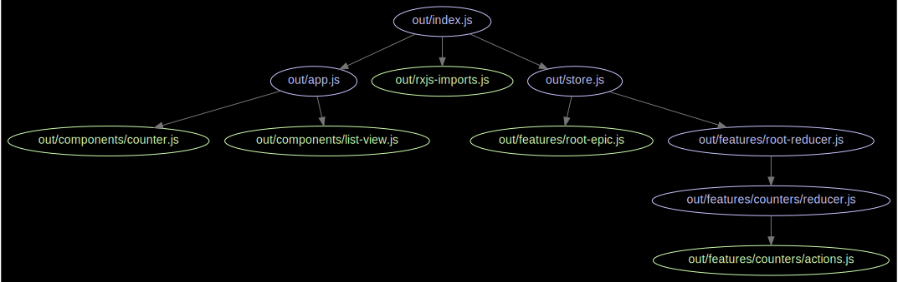

# React / Redux / Typescript / Webpack - Starter
## _Powered by Webpack optimized for performance_

### Recently updated all dependencies!

## Features:
- No babel!  
- Ultra performance  
- Webpack 2 (simple one-file config, separate vendor bundle, dashboard)  
- Setup for `ts-loader` and `awesome-typescript-loader` for comparison (check `npm run dev` or `npm run dev:awesome`)  

- React Hot Loader  


- Dependency graph of the entire application! 🌟 __NEW__  


---

## Installation
- project optimized to use yarn
```
// Clone repo
git clone https://github.com/piotrwitek/react-redux-typescript-webpack-starter

// Install dependencies
npm install

// Run development server with react hot-reload
npm run dev (ts-loader)
```

---

## CLI Commands

#### - Development

`npm run dev` - start dev-server with hot-reload (ts-loader)

`npm run dev:dashboard` - start dev-server with `webpack-dashboard`

`npm run dev:awesome` - start dev-server with `awesome-typescript-loader`

#### - Type checking

`npm run tsc` - entire project type-check

`npm run tsc:watch` - fast incremental type-checking in watch mode

#### - Production Bundling (`dist/` folder)

`npm run clean` - clean dist

`npm run build` - build dist bundle

#### - Utility & Git Hooks

`npm run reinstall` - reinstall all dependencies (useful when switching branch) (note: use `reinstall:win` on Windows)

`npm run lint` - run linter (tslint)

`npm run test` - run tests with jest runner

`npm run test:update` - update jest snapshots

`npm run precommit` - pre commit git hook - linter

`npm run prepush` - pre push git hook - linter, tests and check types

#### - Deployment

~~`npm run deploy` - commit and push all changes found in `/dist` folder to "gh-pages" branch~~

---

## The MIT License (MIT)

Copyright (c) 2016 Piotr Witek <piotrek.witek@gmail.com> (http://piotrwitek.github.io/)
